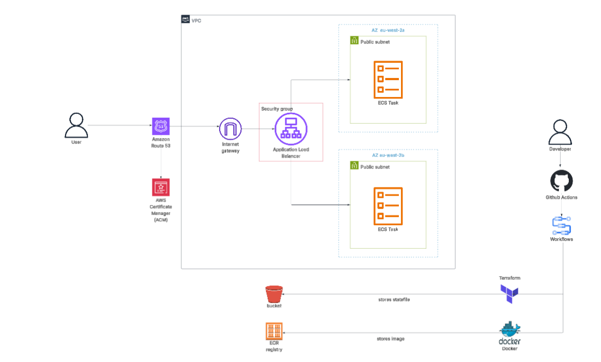
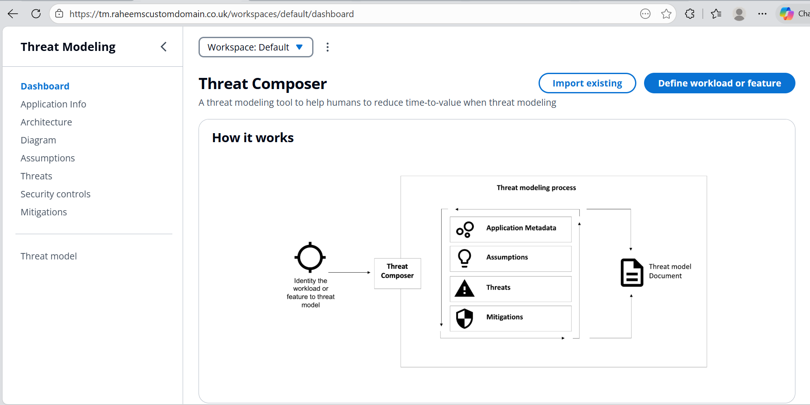

# **Threat Modelling Tool - AWS Deployment**

### **Overview**

This project deploys a containerised web application on AWS using **Docker, ECS (Fargate), and Terraform**. Infrastructure is provisioned as code, with traffic routed through an Application Load Balancer secured by **ACM** and **Route 53**. A GitHub Actions CI/CD pipeline automates image builds, pushes to ECR, and Terraform deployments. The application is accessible at (`tm.raheemscustomdomain.co.uk`)

# **Architecture Diagram**



## Features 
- Terraform-managed AWS infrastructure
- Dockerised application for consistency
- Scalable ECS services with ALB
- Security with IAM roles
- CloudWatch logging & monitoring
- Clean, organised project structure


# Directory Structure

```Terraform/
├── .github/
│   └── workflows/
│       ├── ci.yaml
│      
│      
├── app/
│   └── Dockerfile
│
└── Terraform/
    ├── main.tf
    ├── provider.tf
    ├── variables.tf
    └── modules/
        ├── alb/
        ├── ecs/
        ├── acm/
        ├── ecr/
        └── vpc/
```
# Application on (`tm.raheemscustomdomain.co.uk`)



## Built With
- **AWS:** ECS (Fargate), ALB, ACM, Route 53, CloudWatch
- **Containerization:** Docker
- **Infrastructure as Code:** Terraform
- **CI/CD:** GitHub Actions
- **Domain Management:** Custom HTTPS domain

## CI/CD


- Automated image builds, tests, and pushes to AWS ECR
- Terraform deployments triggered via GitHub Actions workflow

## Setup Instructions 
```
yarn install
yarn build
yarn global add serve
serve -s build

Then visit:
http://localhost:3000
```
